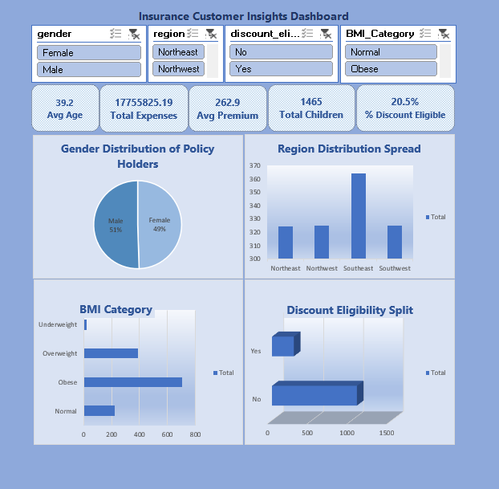
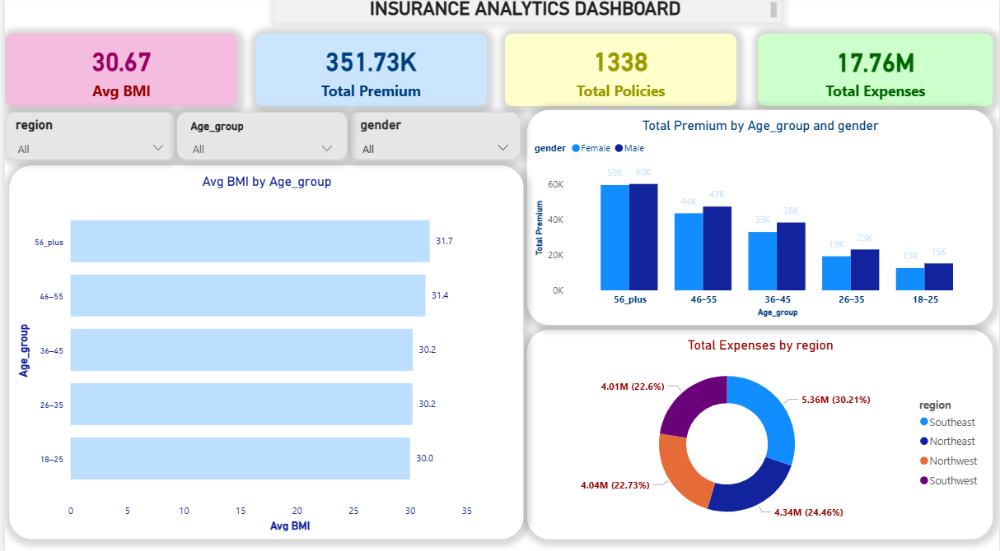

# Insurance Analytics Dashboards – Excel & Power BI Portfolio Project

## **Overview**

Developed two interactive dashboards using Microsoft Excel and Power BI to analyze key
insurance metrics such as customer demographics, expenses, premium distribution, BMI
categories, and policy insights. The project demonstrates strong skills in
**dashboard design** and **data visualization**.

## **Tools Used**

*Microsoft Excel (Advanced Excel, Pivot Tables, Slicers, Pivot Charts)
*Microsoft Power BI (DAX, Data Modeling, Interactive Visuals)

## **Key Highlights**

-Built KPI indicators such as Total Premium, Total Expenses, Total Policies, Average BMI, and
more.
-Designed interactive filters for region, gender, discount eligibility, and BMI category.
-Created visuals including column charts, bar charts, donut charts, and demographic distributions.

##**Excel Dashboard Insights**

-Gender distribution of policy holders

-Region-wise distribution

-BMI category segmentation

-Discount eligibility analysis

-Expense and premium KPI metrics

##**Power BI Dashboard Insights**

-Premium distribution by age group and gender

-Total expenses by region

-BMI trends across customers

-Policy count metrics and customer segmentation

## Screenshots
### Excel Dashboard

### Power BI Dashboard
